# Student Department System

## Table of Contents:
- [Description](#Description)
- [Prerequisites](#Prerequisites)
- [Features](#features)
- [Installation](#installation)
- [Contributing](#contributing)
- [Login](#1) 
- [Sign Up](#2) 
- [Home Page](#3) 
- [Students List](#4) 
- [Department List](#5) 
- [Create New Student](#6) 
- [Create New Depatment](#7) 
- [Update Student](#8) 
- [Update Department](#9) 
- [Student Details](#10) 
- [Department Details](#11) 

## Description:
The CRUD Project - Student Department System is a helpful computer program made with ASP.NET MVC. It helps schools and colleges keep track of students and departments easily. This system makes it simple to add, view, update, and remove student and department info.

Imagine it like a super easy tool for teachers and office staff. They can quickly manage student records and department details without any confusion. It makes school work smoother and saves time, making everyone happy!

## Prerequisites:
- [Visual Studio](https://visualstudio.microsoft.com/downloads/)
- [SQL Server](https://www.microsoft.com/en-us/sql-server/sql-server-downloads) 
- [Entity Framework](https://learn.microsoft.com/en-us/ef/core/get-started/overview/install)
- [.NET Framework](https://dotnet.microsoft.com/download)
## Features:
- Creation: Add new department or student records into the system.
- Reading: Retrieve and view department and student information.
- Updating: Update details of existing departments or student profiles.
- Deletion: Remove records from the database.

## Installation:
- Clone this repository to your local machine: `git clone https://github.com/ammar-gamal/Student-Department-System.git`
- Open the project in Visual Studio
- Build the solution
- Run the application

## Contributing:
**If you'd like to contribute to this project, please follow these guidelines:**
- Fork the repository.
- Create a new branch for your changes: `git checkout -b feature/your-feature-name`
- Commit your changes: `git commit -m "Add feature"`
- Push to your branch: `git push origin feature/your-feature-name`
- Create a pull request.

## Screenshots:

- > **Login**
     - 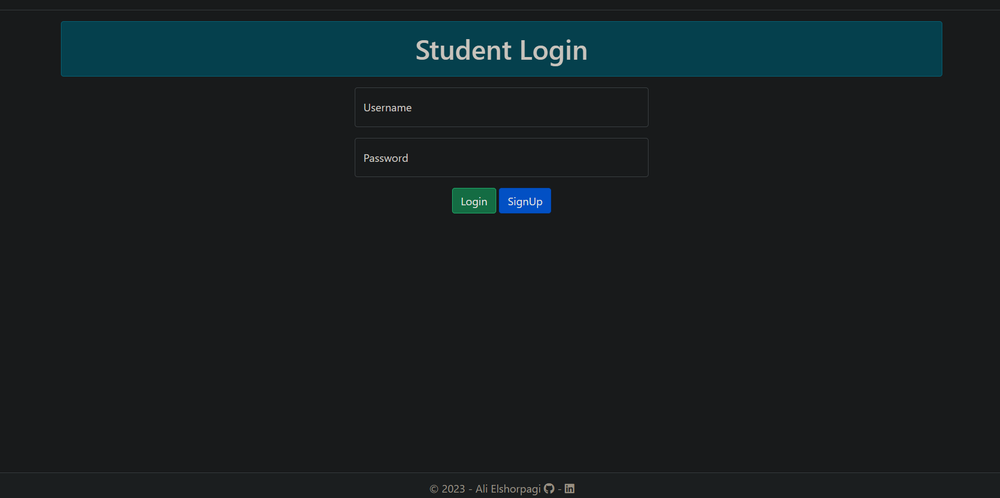
- > **Sign Up**
     - 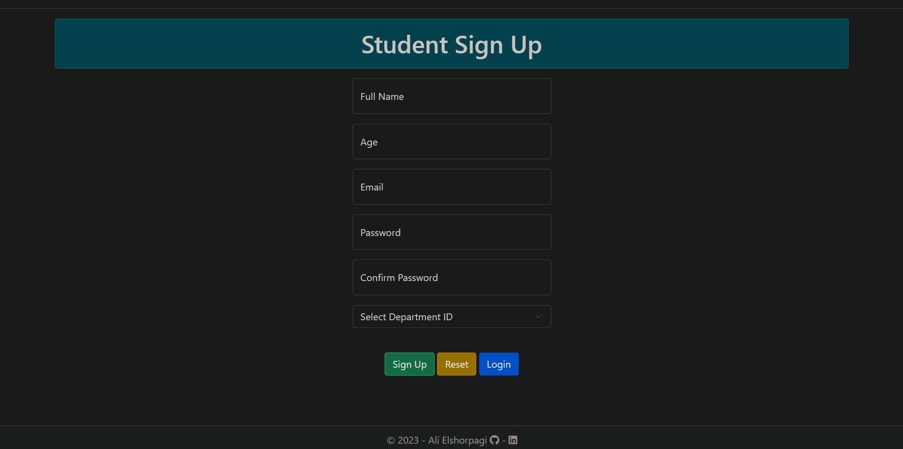
- > **Home Page**
     - 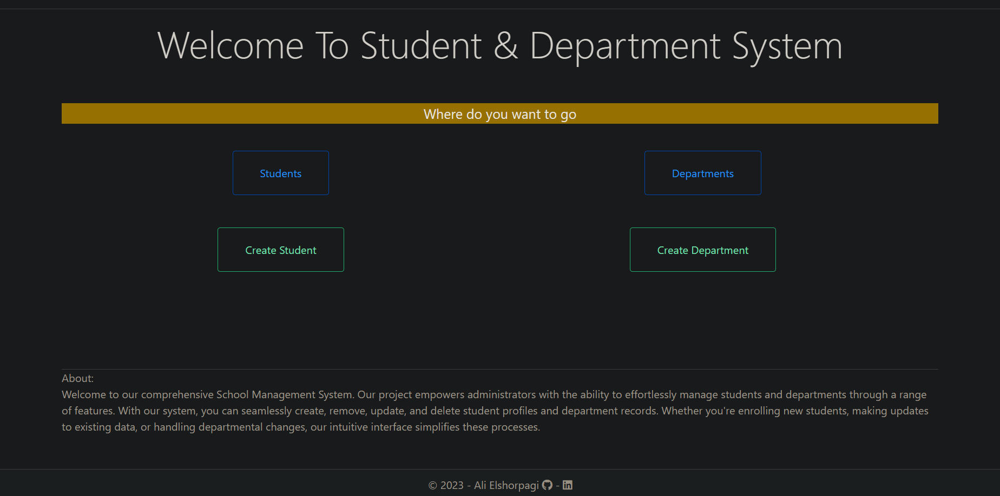
- > **Students List**
     - 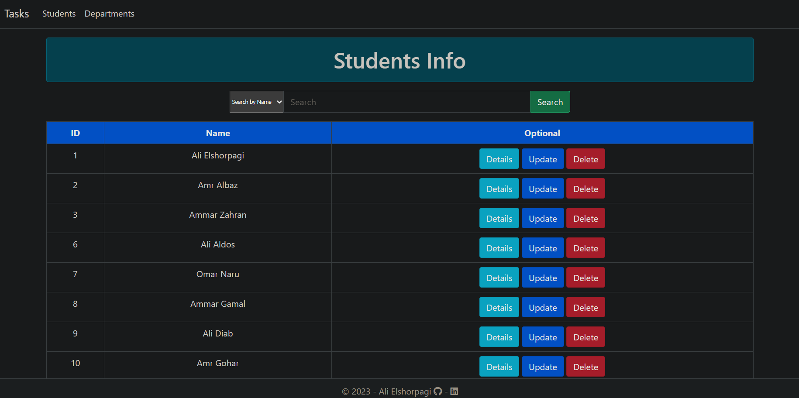
- > **Department List**
     - 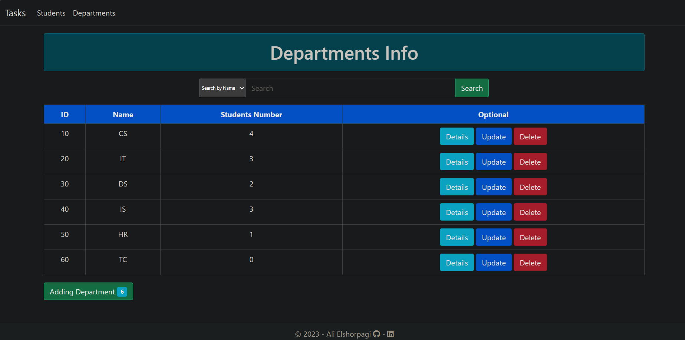
- > **Create New Student**
     - 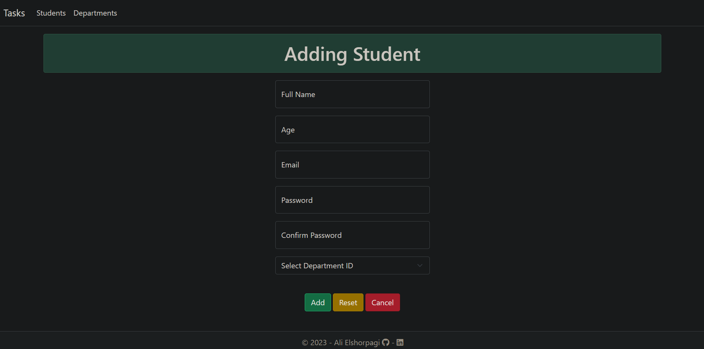
- > **Create New Depatment**
     - 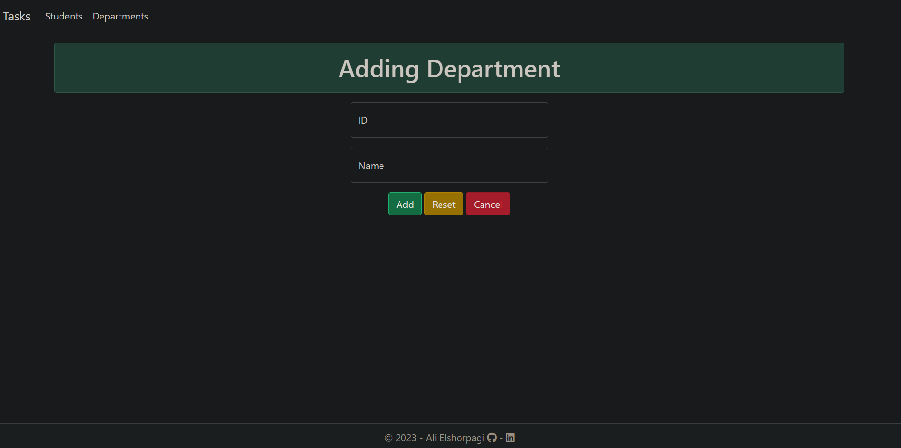
- > **Updating Student**
     - 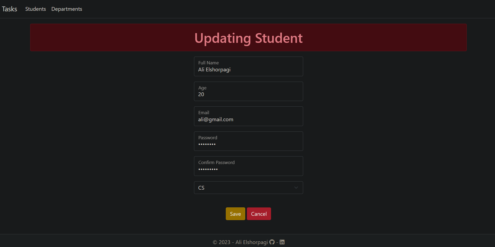
- > **Updating Department**
     - 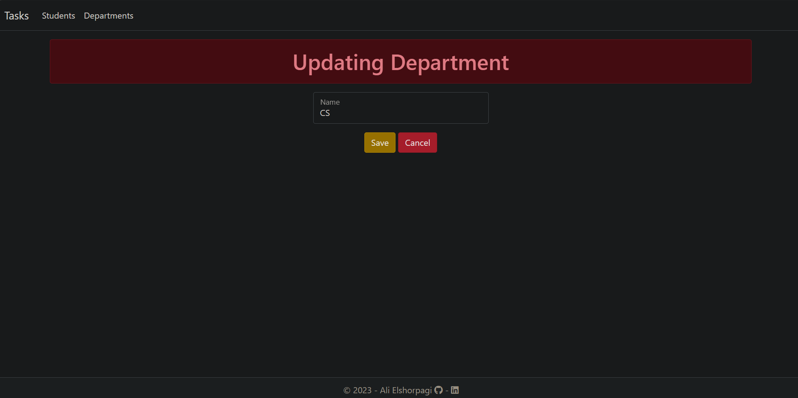
- > **Student Details**
     - 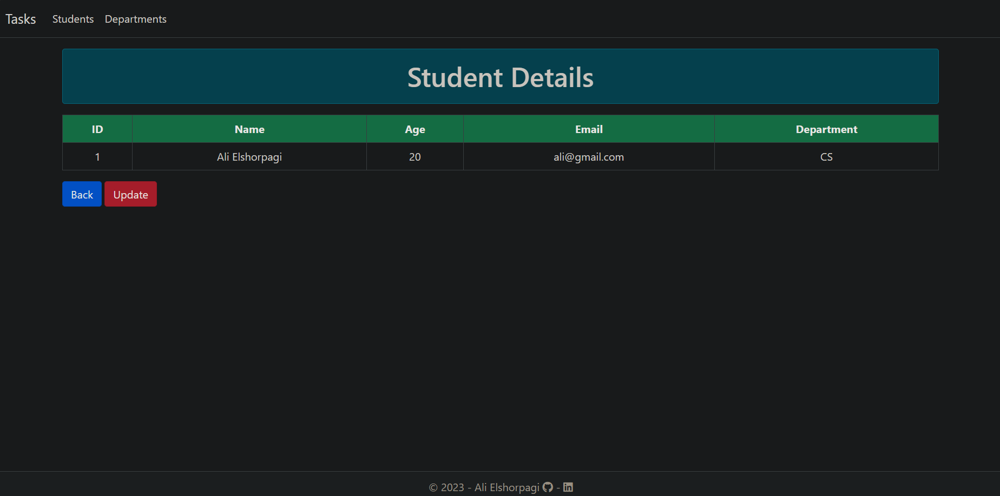
- > **Department Details**
     - 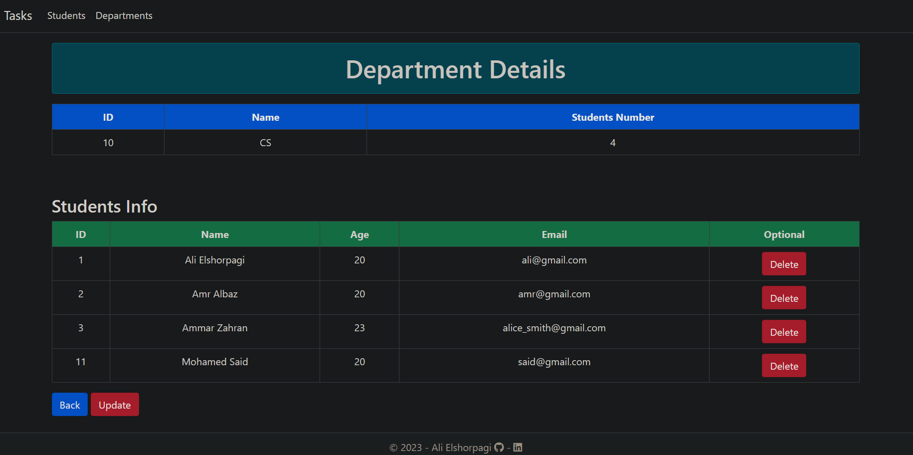
     - 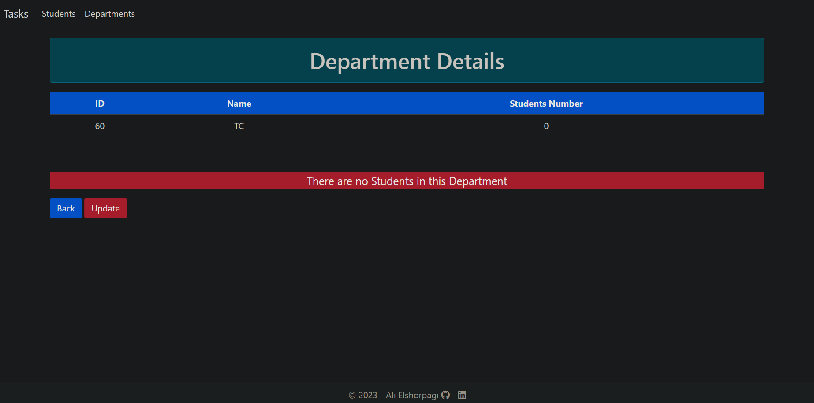

