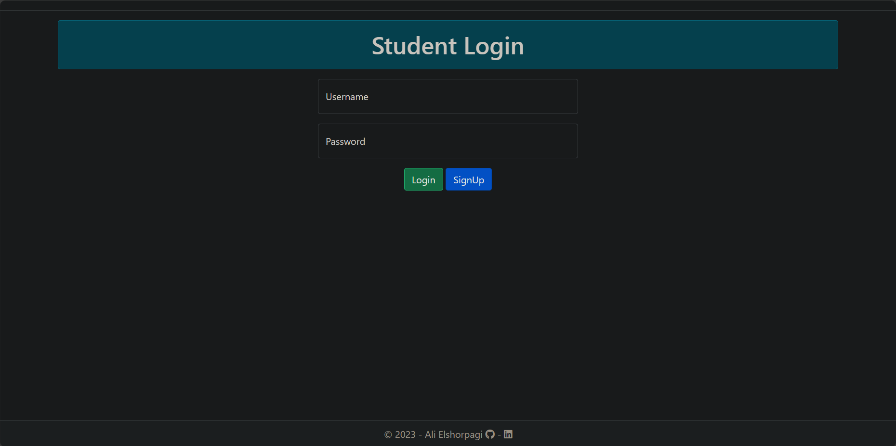
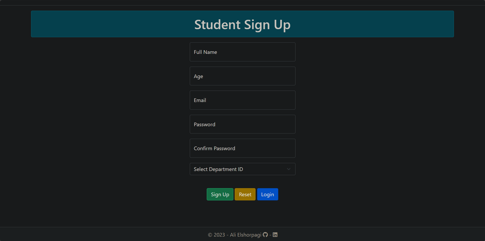

# Student Department System

## Description

## Table of Contents:
   1. [Login](#1) 
   1. [Sign Up](#2) 
   1. [Home Page](#3) 
   1. [Students List](#4) 
   1. [Department List](#5) 
   1. [Create New Student](#6) 
   1. [Create New Depatment](#7) 
   1. [Update Student](#8) 
   1. [Update Department](#9) 
   1. [Student Details](#10) 
   1. [Department Details](#11) 
   1. [Binary Tree](#12) 
   1. [Binary Search Tree ( Binary Node )](#13) 
   1. [Binary Search Tree](#14) 
   1. [Min Binary Heap](#15) 
   1. [Max Binary Heap](#16)
   1. [AVL Tree ( Binary Node )](#17) 
   1. [AVL Tree](#18) 
   1. [Priority Queue Heap Based](#19) 
   1. [Priority Queue AVL Tree Based](#20) 
   1. [Trie Tree ( Letter )](#21) 
   1. [Hash Table](#22) 

## Contents:

- > [**Login**]
  - 
- > [**Sign Up**]
  - 
- > [**Home Page**]

- > [**Students List**]

- > [**Department List**]

- > [**Create New Student**]

- > [**Create New Depatment**]

- > [**Updating Student**]

- > [**Updating Department**]

- > [**Student Details**]

- > [**Department Details**]